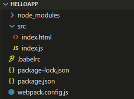
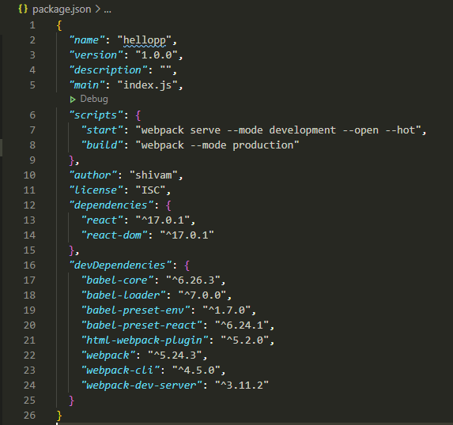
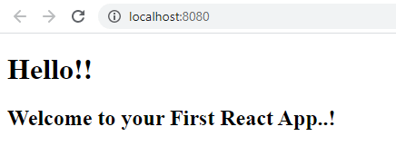

## Introduction

As a beginner in React.js, I used to setting up my react application using a single command line tool called create-react-app (CRA) which is a open source project developed by developers at Facebook for bootstrapping your react application and serve a simple boilerplate. But as a developer I’m always curious to understand what actually this command does ? What are the other dependencies required to serve a react application ? As a beginner I was thinking like react-scripts is the only dependency that required to build and run react app. But as I drill down more in React I get to know more about transpiler and bundler.
<!--truncate-->

I get to know that there were various ways to create a React app. create-react-app is abstract way of creating a react app as it hide all the configurations and not provide us a flexibility to add a custom build configs. So I moved to configure Webpack and Babel by my own configuration which is actually used in create-react-app but it’s configuration is abstract.

I’m assuming that you know about React.js and you are here to learn configuration of Webpack and Babel in your project.

## Why do we use Babel?
Well answer is simple enough, Our browser is not compatible for the latest ECMAScript syntax and hence Babel will help us to trans-compile (transpile) latest ECMAScript syntax into ES5 or ES6 code which is browser compatible or transform code into backward compatibility.

If you don’t want to use Babel, you need to have knowledge of ES5 or ES6 syntax for React.js app development.

## What exactly is webpack?

In simple word, Webpack is a bundler of your application. In your project you are likely to create many components and these components will be written in separate files right !. Now imagine the case, you have 10 components in you app and that’s why obviously 10 script files. Now if you want to deploy you application, you need to keep track of all these files and also their dependencies. So, here Webpack will come in picture.

Webpack will keep track of your all files and create a dependency graph for you application and most probably create a single file which will bundle all your files along with you dependencies. Isn’t it a great thing!

## Creating a folder structure

Now we will see how to maintain files in folders. This structure may be get vary according to you choice. I’ll show you structure which I personally prefer. Choice is yours!

1. Create a folder and name it as per your application name.
2. Open folder in command prompt (cmd).
3. Run the following command in cmd:

```cmd
npm init
```
1. This will ask you some basic information like package name, author name. description, and license. With this info it will create a file called package.json
2. Create a src folder inside your project folder and add empty files named as index.js and index.html and create two config files at your project level called .babelrc and webpack.config.js like this:



**Note:** File name for .babelrc and webpack.config.js should be exactly same as mentioned.

## Installations

Now we need to install some packages which are essentially required for configuring React application with Babel and Webpack.

1. Install our main dependency package, React and React DOM.

```cmd
npm i -S react react-dom
```
2. Install Babel as a dev dependency for your application.

```cmd
npm i -D babel-core babel-loader babel-preset-env babel-preset-react
```
* **babel-core**: It is the main engine package for the babel.
* **babel-loader**: Loader will transpiles the react JSX code in backward compatible js code with the help of babel and webpack.
* **babel-preset-env**: Add support to ES5/ES6 JavaScript.
* **babel-preset-react**: Add support for React JSX code. 

**Note**: babel-loader8.* requires babel7.. If you’d like to use babel6.. You should install babel-loader.7.*

```cmd
npm install --save-dev babel-loader@7.0.0
```
OR

```cmd
npm install --save-dev @babel/core
```
1. Install Webpack as a dev dependency for your application.

```cmd
npm i -D webpack webpack-cli webpack-dev-server html-webpack-plugin
```
* **webpack**: Main engine for the webpack plugins.
* **webpack-cli**: Provides a command line tool for setting up webpack and it’s plugins.
* **webpack-dev-server**: This will help us to develop a live server for your application.
* **html-webpack-plugin**: Help to create a HTML template for your application.

These are the minimal required packages which you need to install. Now, let’s move for adding configurations in config files.

## Configuring Babel

In ._babelrc_ file we will define the presets which we will be using in your application.

Paste the below content in your _.babelrc_

```json
{"presets":["env", "react"]}
```

## Configuring Webpack

In _webpack.config.js_ you need to add following configs

```js
//webpack.config.js
const path = require('path');
const HtmlWebpackPlugin = require('html-webpack-plugin');
module.exports = {
   entry: './src/index.js',
   output: {
      path: path.join(__dirname, '/dist'),
      filename: 'bundle.js'
   },
   devServer: {
      port: 8080
   },
   module: {
      rules: [
         {
            test: /\.jsx?$/,
            exclude: /node_modules/,
            loader: 'babel-loader',
         },
         {
            test: /\.css$/,
            use: [ 'style-loader', 'css-loader' ]
        }
      ]
   },
   plugins:[
       new HtmlWebpackPlugin({
            template: path.join(__dirname,'/src/index.html')
       }) 
   ]
}
```
* **entry**: Here we will define entry point of our application. From this point webpack will start bundling.
* **output**: We will define the location where the bundled file will reside. i.e., at /dist/bundle.js
* **devServer**: Here development server related configurations present like we provided port number 8080 for development server.
* **test**: We define some regular expression that define which files will pass through which loader.
* **exclude**: Define files that should be excluded by loader.
* **loader**: Define the loaders here which we are going to use.

## Setting Scripts in _package.json_

We require some script command to run and build application, for that we need to define some script in package.json.

```json
"start": "webpack serve --mode development --open --hot",
"build": "webpack --mode production"
```

Now your package.json will look like this:



## Creating a React Component

Now let’s add a simple hello world component in your application. Your index.js and index.html files will look like this:

```jsx
//index.js

import React from "react";
import ReactDOM from "react-dom";

const App = () => {
  return (
    <div>
      <h1>Hello!!</h1>
      <h2>Welcome to your First React App..!</h2>
    </div>
  );
};

ReactDOM.render(<App />, document.getElementById("root"));
```
```html
<!-- index.html -->

<!DOCTYPE html>
<html lang = "en">
   <head>
      <meta charset = "UTF-8">
      <title>React Web</title>
   </head>
   <body>
      <div id = "root"></div>
      <script src = 'bundle.js'></script>
   </body>
</html>
```

## Run the app

I’m very excited to run our application and check if it is working properly. Run below command and it will open your application in browser.

```cmd
npm start
```
Your application will open at http://localhost:8080/



To generate the production bundle you should run below command.

```cmd
npm run build
```

Above command will create a dist folder and inside that it will create two files called bundle.js and index.html which are production ready files.

Congratulations!! You have successfully configured your react application with Webpack and Babel.

## Conclusion

In this blog we understood the use of webpack, babel and how to develop a react application by configuring webpack and babel.

>Thanks for reading this blog post. Hope it’s been useful for you.
 If you found this article useful, please share it with your friends and colleagues!❤️

 This article was originally published [here](https://dev.to/shivampawar/setup-webpack-and-babel-for-a-react-js-application-24f5)


