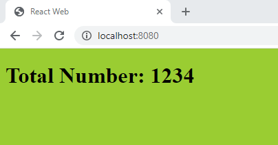
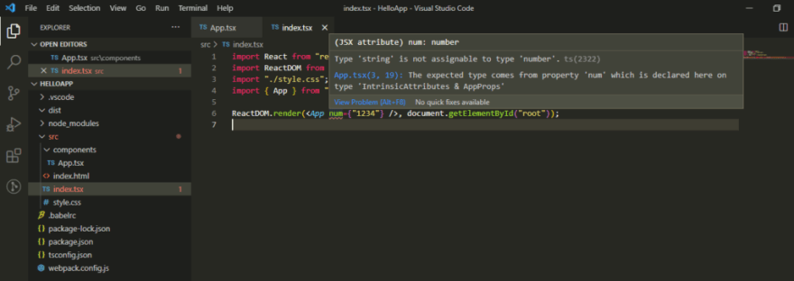
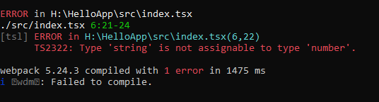

In this post we will learn how to add support of TypeScript to your React Js application having webpack and babel configured.

Please note that in this post I’m going to modify previously setup React Js application to add support for TypeScript. If you haven’t yet gone through that post then please start with [Setup Webpack and Babel for a React Js](https://dev.to/shivampawar/setup-webpack-and-babel-for-a-react-js-application-24f5) Application and come back to this post.

<!--truncate-->

## Why Typescript?

According to [official documentation](https://www.typescriptlang.org/), TypeScript is a strongly typed superset of JavaScript which uses TypeScript Compiler to compile it into plain JavaScript. TypeScript provide pure Object Oriented implementation to use classes, interfaces and inheritance.

TypeScript check error in code at compile time and if any error found, then it shows the mistakes before the script is run. Also it support all existing JavaScript library as it is a superset of JavaScript. It make development quick and easy as possible and developers can save lot of time.

## Installations

We need to install some packages which are essential to configure TypeScript in React application.

Run below commands to install required packages:

```cmd
npm install -D typescript ts-loader @types/node @types/react @types/react-dom
```

- **typescript** package is main engine for TypeScript.
- **ts-loader** is loader for Webpack that integrates TypeScript in Webpack. This will convert files with .ts extension into .js files and bundle it.
- **@types/node**, **@types/react** and **@types/react-dom** contains the type definitions required for node, react and react dom.

## Configuring Typescript

Add tsconfig.json file to the root directory location where package.json exists. Name should be exact same as mentioned and the below configurations into it.

```json
//tsconfig.json

{
  "compilerOptions": {
    "outDir": "./dist/",
    "noImplicitAny": true,
    "module": "es6",
    "target": "es5",
    "jsx": "react",
    "allowJs": true,
    "allowSyntheticDefaultImports": true,
    "moduleResolution": "Node"
  }
}
```

## Configuring Webpack

Webpack need to be configured to have support for TypeScript files. Here is small change you need to add in webpack.config.js

Add ts-loader (loader) and test for **_ts_** and **_tsx_** files.

```js
//webpack.config.js
{
   test: /\.tsx?$/,
   exclude: /node_modules/,
   loader: 'ts-loader'
}
```

add Test for **_ts_** and **_tsx_** extension to resolve:

```js
//webpack.config.js
...
resolve:
{
   extensions: [ '.tsx', '.ts', '.js' ],
}
...
```

And one final change in webpack config is to rename the \_js \_files to \_tsx \_in your react application and update the entry point

```js
//webpack.config.js
...
entry: "./src/index.tsx",
...
```

## Testing Working for Typescript with React

To test the application, we create one component App which will take one prop of type number which will get passed by index.tsx

```jsx
//index.tsx

import React from "react";
import ReactDOM from "react-dom";
import "./style.css";
import { App } from "./components/App";

ReactDOM.render(<App num={1234} />, document.getElementById("root"));
```

```jsx
//components/App.tsx

import React from "react";

type AppProps = { num: number };

export const App = ({ num }: AppProps) => <h1>Total Number: {num}</h1>;
```

Boo-yah!😍 We are all set with TypeScript❤️.



Now just try to change the value which we were passing through props.

For example I’ll just change number 1234 to string “1234” and check what will happen.



As expected, Intellisense will show error like this so that we will identify it before building application. Isn’t it a great thing!

Also if we try to build it, command prompt will show error like this:



Error are self explanatory so that we can easily identify mistakes and correct it.

## Conclusion

In this blog post we successfully configured TypeScript with React application and tested if it works properly or not.

> If you found this article useful, please share it with your friends and colleagues!❤️

This article was originally published [here](https://dev.to/shivampawar/setup-react-application-using-typescript-and-webpack-2kn6)
