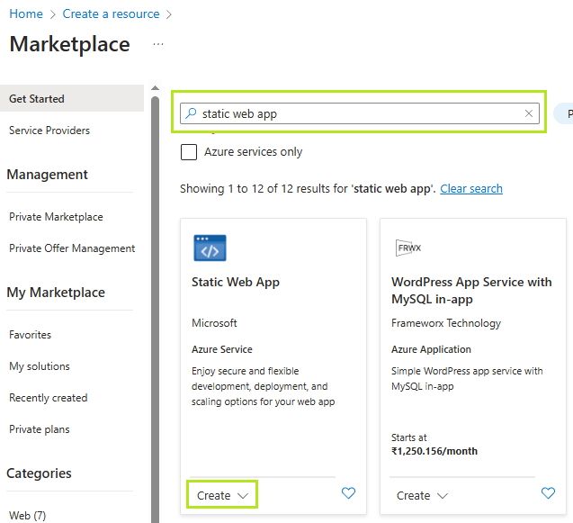
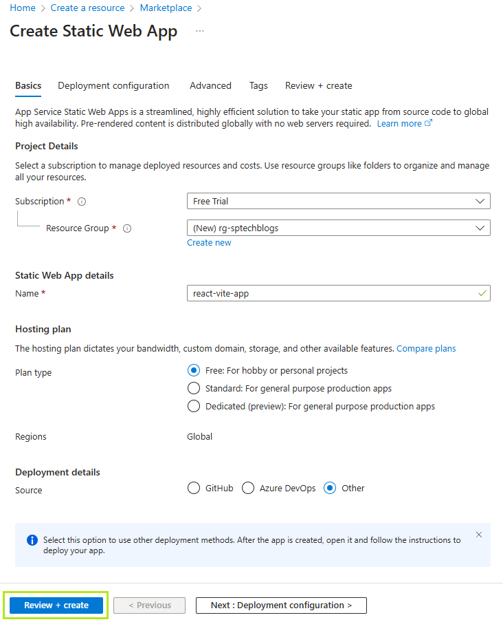
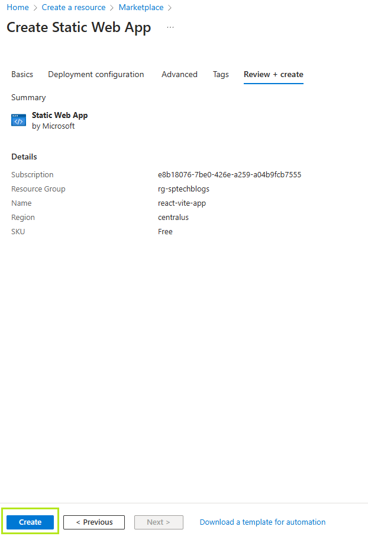
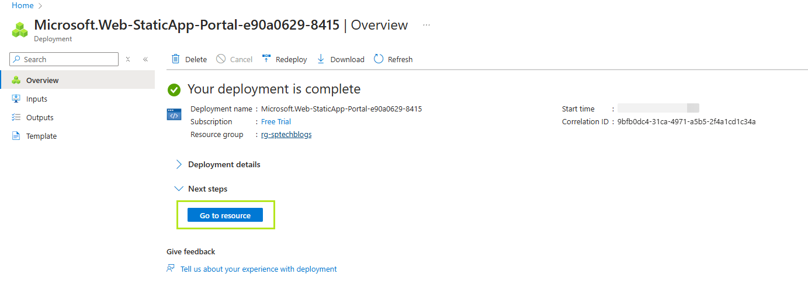
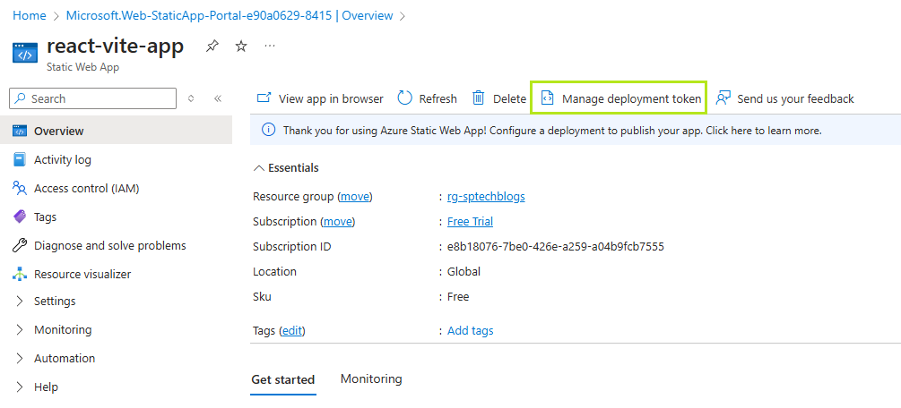
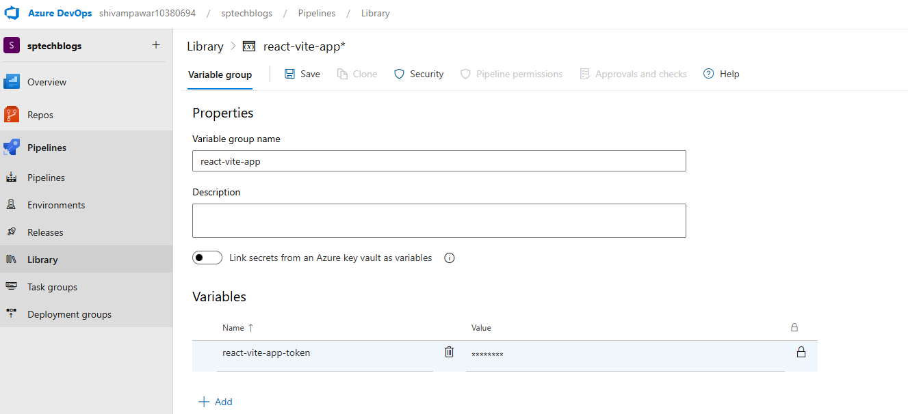
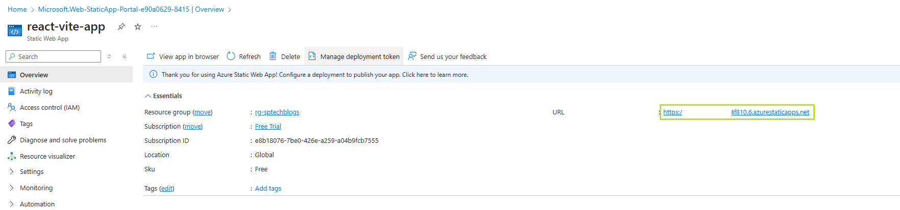

# How to Publish Your React App on Azure Static Web App Using Azure CI/CD

Are you building a React app and want to publish it using Azure? This guide will walk you through deploying your React app to **Azure Static Web Apps** using **Azure DevOps Repos** and **Azure Pipelines** — without GitHub.

Even if you're a beginner, don’t worry. I’ll guide you step-by-step, just like a teacher explaining things in a classroom. 😊

<!--truncate-->

---

## Pre-requisites

Before we begin, make sure you have the following:

1. **A React App** (using Vite for fast development)
   ```bash
   npm create vite@latest
   cd <your_app_name>
   ```

2. **Azure Account**  
   Sign up for free: [https://azure.microsoft.com/free](https://azure.microsoft.com/free)

3. **Azure DevOps Account**  
   Create one at: [https://dev.azure.com](https://dev.azure.com)

---

## Step 1: Push Your Code to Azure Repos

1. Go to [https://dev.azure.com](https://dev.azure.com)
2. Create a **new project**
3. Navigate to **Repos** > **Clone** and copy the Git URL
4. In your terminal, run the following commands:

```bash
git init
git remote add origin https://dev.azure.com/YOUR_ORG/YOUR_PROJECT/_git/YOUR_REPO
git add .
git commit -m "Initial commit"
git push -u origin main
```

---

## Step 2: Create a Static Web App on Azure

1. Go to the [Azure Portal](https://portal.azure.com)
2. Search for **Static Web Apps** and click **Create**

   

3. Fill out the form:
   - **Subscription**: Choose your Azure subscription
   - **Resource Group**: Create or select an existing one
   - **Name**: Enter a unique name
   - **Region**: Pick a region near your users
   - **Deployment Details**: Choose **Other** for source control

   

4. Click **Review + Create** and then **Create**

   

5. Once deployed, click **Go to Resource**

   

---

## Step 3: Set Up Azure Pipeline for CI/CD

1. In Azure DevOps, go to your project
2. Click on **Pipelines** > **Create Pipeline**
3. Choose **Azure Repos Git** as your source
4. Select your repo
5. Choose **Starter Pipeline** and replace the YAML with:

```yaml
trigger:
  branches:
    include:
      - master
      - main

pool:
  vmImage: ubuntu-latest

steps:
  - task: NodeTool@0
    inputs:
      versionSpec: '22.x'
    displayName: 'Install Node.js'

  - script: |
      npm install
      npm run build
    displayName: 'Build React App'

  - task: AzureStaticWebApp@0
    inputs:
      app_location: '/'
      output_location: 'dist'
      azure_static_web_apps_api_token: $(deployment_token)
```

6. Click **Save and run**

---

## Step 4: Add Deployment Token to Pipeline

The deployment token authorizes your pipeline to deploy to Azure.

1. In the Azure Portal, open your **Static Web App**
2. Under **Settings**, click **Manage Deployment Token**

   

3. Copy the token

In Azure DevOps:

1. Go to **Pipelines** > **Library**
2. Create a new **Variable Group**
3. Add a variable:
   - **Name**: `deployment_token`
   - **Value**: *Paste the token you copied*
   - **Keep this value secret**: ✔️

   

4. Link this variable group to your pipeline by adding it to your YAML file:

```yaml
variables:
  - group: <YOUR_VARIABLE_GROUP_NAME>
```

---

## Final `azure-pipelines.yml` File (With Token Variable Group)

```yaml
trigger:
  branches:
    include:
      - master
      - main

pool:
  vmImage: ubuntu-latest

variables:
  - group: react-vite-app

steps:
  - task: NodeTool@0
    inputs:
      versionSpec: '22.x'
    displayName: 'Install Node.js'

  - script: |
      npm install
      npm run build
    displayName: 'Build React App'

  - task: AzureStaticWebApp@0
    inputs:
      app_location: '/'
      output_location: 'dist'
      azure_static_web_apps_api_token: $(deployment_token)
```
> ℹ️  With the `trigger` configuration, the pipeline will automatically run every time new code is pushed to the `main` or `master` branch.
---

## Step 5: Access Your Live Web App

1. Go to the [Azure Portal](https://portal.azure.com)
2. Open your **Static Web App** resource
3. Copy the **URL** from the overview page

   

4. Open the URL in your browser to see your deployed React app live! 🎉

---

## Summary

Here's a recap of what you did:

- Created and pushed a React app to Azure Repos
- Created a Static Web App on Azure
- Set up a CI/CD pipeline using Azure Pipelines
- Used a secure deployment token to publish your app
- Launched and verified your deployed site

You’ve now published your first React app to Azure without using GitHub! Keep building, keep exploring.

> If you found this article useful, please share it with your friends and colleagues!❤️

Read more articles on ➡️ [Dev.To](https://dev.to/shivampawar)

Follow me on ⤵️

<p align="left">
  <a href="https://dev.to/shivampawar">
    
  </a>
  <a href="https://www.linkedin.com/in/shivam-prakash-pawar">
    
  </a>
  <a href="https://github.com/shivam-pawar">
    
  </a>
</p>

