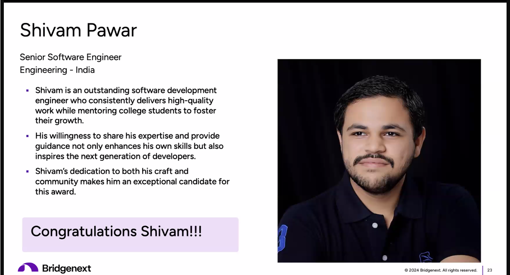

### I'm here to help your next project

A skilled, competent, and diligent individual, specializing in the modern web development (React js - Redux) and Machine Learning algorithms. For the last 6 years, I have been developing applications using JavaScript, C# and Python programming languages.

I’ve hands on in all stages of the programming cycle, from planning to design and deployment. No two days are the same for me; my tasks may involve analyzing algorithms, altering code, fixing bugs, brainstorming ideas or integrating new systems.

###### ✅ Problem Solving 
###### 🌐 Search A Lot

###### 💡 Creative Idea

###### ✌️ High Quality

### Technology Stack

#### **Frontend Development**

#### **Backend Development**

#### **DevOps & Cloud**

#### **Build Tools**

#### **Database**

### Certifications

*   [Microsoft Certified: Azure Fundamentals](https://www.credly.com/badges/e9010a98-7990-4035-87e5-fe7ea5769903?source=linked_in_profile) 
*   [Red Hat Certified System Administrator - EX200](https://rhtapps.redhat.com/verify?certId=180-127-532) 
*   [React: Ecosystems](https://www.linkedin.com/learning/react-ecosystems) 
*   [React: Server-Side Rendering](https://www.linkedin.com/learning/react-server-side-rendering-8539269) 
*   [ASP.NET MVC 5 Essential Training](https://www.linkedin.com/learning/asp-dot-net-mvc-5-essential-training-4) 
*   [Python for Data Science and AI](https://www.credly.com/badges/42ecc868-4ec4-41d5-affc-4137107bea2d?source=linked_in_profile)
*   [Data Visualization with Plotly Express](https://www.coursera.org/account/accomplishments/verify/6AXMSKRR48W8)
  

### Gallery
🏆 Bridge Builder Award

🏆 Excellence Award

🏆 Spot Award June 23

🏆 Spot Award Jan 23

